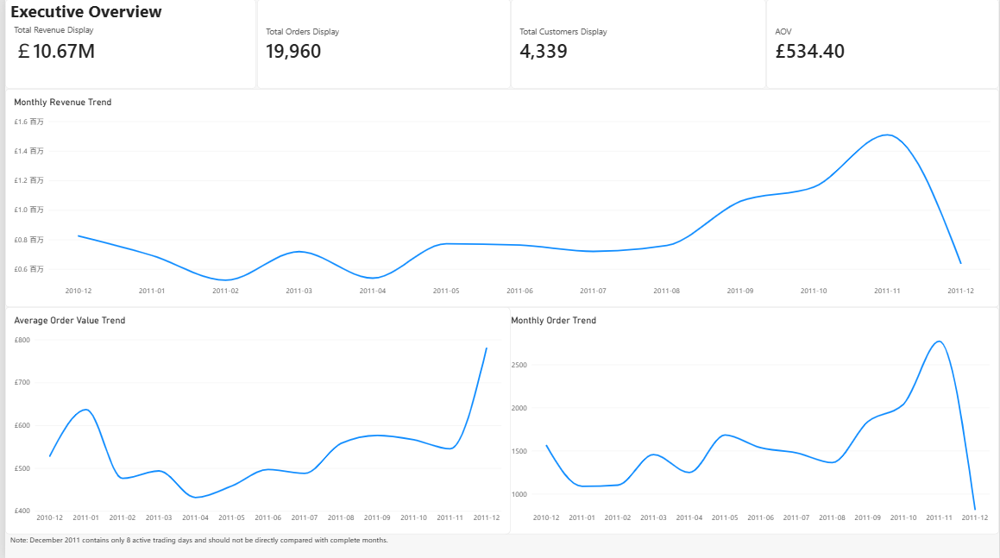
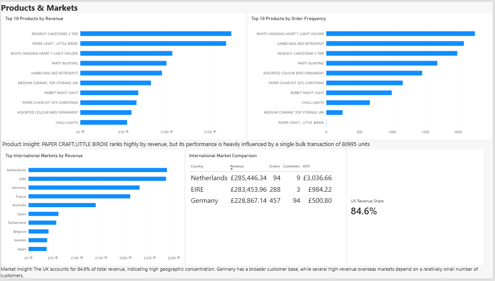
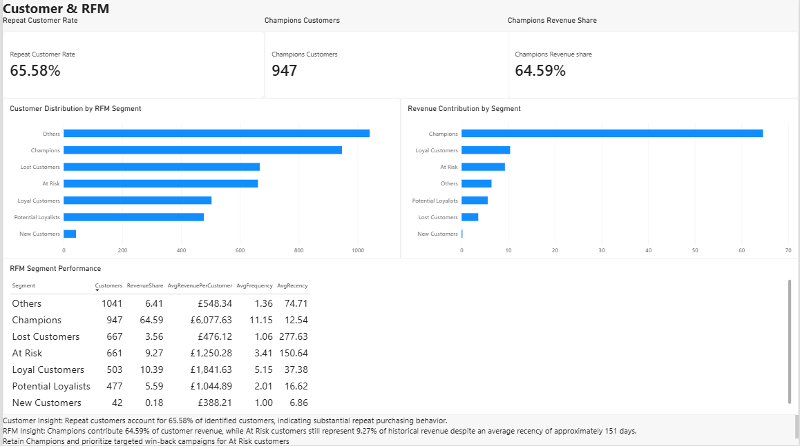

# E-commerce Sales & Customer Analytics

## Project Overview

This project analyzes more than 540,000 transaction records from the UCI Online Retail dataset to understand sales performance, product demand, international markets, customer purchasing behavior, and customer value.

The project combines Python, Pandas, Matplotlib, RFM customer segmentation, DAX, and Power BI to transform raw transaction data into business insights.

The final Power BI dashboard contains three pages:

- Executive Overview
- Products & Markets
- Customer & RFM

## Business Questions

The analysis focuses on the following questions:

1. How did revenue and order volume change over time?
2. Which products generated the most revenue?
3. Are high-revenue products also widely purchased?
4. Which international markets contributed the most revenue?
5. How concentrated is the business geographically?
6. How many customers made repeat purchases?
7. Which customer groups generated the most revenue?
8. Which customers may be at risk of becoming inactive?

## Dataset

The project uses the UCI Online Retail dataset containing more than 540,000 transaction records from a UK-based online retailer.

Main variables include:

- Invoice number
- Product code
- Product description
- Quantity
- Invoice date
- Unit price
- Customer ID
- Country

## Tools Used

- Python
- Pandas
- Matplotlib
- Google Colab
- Power BI
- DAX
- RFM Analysis

## Data Cleaning

Cancelled transactions were identified using invoice numbers beginning with `C`.

Negative quantity transactions were investigated separately.

Some negative quantity records were not customer cancellations. Further investigation showed that these transactions had a unit price of zero and descriptions such as damages, missing stock, checks, destroyed goods, wet damage, and inventory adjustments.

These records were therefore excluded from normal sales analysis.

The final normal-sales dataset retained transactions satisfying:

- Quantity greater than 0
- Unit Price greater than 0
- Cancelled equals False

Revenue was calculated as:

`Revenue = Quantity × UnitPrice`

## Key Findings

### Sales Performance

Total revenue reached approximately **£10.67M**.

The dataset contained approximately **19,960 valid orders**.

Average Order Value was approximately **£534.40**.

December 2011 contains only **8 active trading days**, so it should not be directly compared with complete months.

Compared with November:

- Daily order volume decreased by approximately **3.87%**
- Daily revenue increased by approximately **37.53%**
- Average Order Value increased by approximately **43.08%**

This indicates that the increase in daily revenue during the recorded December period was mainly driven by larger order values rather than higher order volume.

### Product Performance

`REGENCY CAKESTAND 3 TIER` was the highest-revenue product.

`PAPER CRAFT, LITTLE BIRDIE` initially ranked among the highest-performing products by revenue and sales volume.

However, further investigation showed that its performance was heavily influenced by a single bulk transaction containing **80,995 units**.

After excluding this extreme transaction, the product dropped out of the Top 10 ranking.

This demonstrates the importance of investigating extreme transactions before interpreting product rankings.

### Product Revenue Concentration

The Top 10 products contributed approximately **9.51%** of total product revenue.

The Top 20 products contributed approximately **13.28%**.

This suggests that product revenue is relatively diversified across a large number of SKUs rather than being highly concentrated in a small number of products.

## International Market Analysis

The United Kingdom accounted for approximately **84.6% of total revenue**.

This indicates a high level of geographic revenue concentration.

The largest international markets by revenue included:

- Netherlands
- EIRE
- Germany

Selected market metrics:

| Country | Revenue | Orders | Customers | AOV |
|---|---:|---:|---:|---:|
| Netherlands | £285,446.34 | 94 | 9 | £3,036.66 |
| EIRE | £283,453.96 | 288 | 3 | £984.22 |
| Germany | £228,867.14 | 457 | 94 | £500.80 |

Although the Netherlands generated more revenue than Germany, Germany had significantly more customers and orders.

This suggests that Germany had a broader and more diversified customer base, while some high-revenue international markets depended more heavily on a relatively small number of customers.

## Customer Analysis

A repeat customer was defined as a customer with more than one unique order.

The Repeat Customer Rate was:

**65.58%**

This means that approximately two-thirds of identified customers placed more than one order during the observed period.

The median customer had:

- Recency: **51 days**
- Frequency: **2 orders**

## RFM Customer Segmentation

Customers were segmented using the RFM framework:

- Recency: days since the customer's most recent purchase
- Frequency: number of unique orders
- Monetary Value: total revenue generated by the customer

Each RFM dimension was scored from 1 to 5 using customer quintiles.

Customers were classified into the following segments:

- Champions
- Loyal Customers
- Potential Loyalists
- New Customers
- At Risk
- Lost Customers
- Others

### Champions

Champions included **947 customers**.

They contributed approximately **64.59% of customer revenue**.

Their average purchase frequency was approximately **11.15 orders**.

Their average recency was approximately **12.5 days**.

Champions represent the most valuable customer group because they purchase frequently, generate high revenue, and have purchased recently.

### At Risk Customers

At Risk customers included **661 customers**.

They contributed approximately **9.27% of historical customer revenue**.

Their average purchase frequency was approximately **3.41 orders**.

Their average recency was approximately **151 days**.

These customers previously demonstrated meaningful purchasing activity but have not purchased recently, making them potential targets for reactivation campaigns.

### Lost Customers

Lost Customers had an average recency of approximately **278 days** and an average purchase frequency close to **1 order**.

Compared with At Risk customers, this group showed lower historical engagement and may be more suitable for lower-cost automated reactivation strategies.

## Business Recommendations

### Retain Champions

Champions generate the majority of customer revenue.

Recommended actions include:

- VIP programs
- Loyalty benefits
- Early access to new products
- Personalized recommendations

### Reactivate At Risk Customers

At Risk customers previously demonstrated purchasing value but have not purchased recently.

Recommended actions include:

- Targeted win-back campaigns
- Personalized email offers
- Limited-time promotions
- Product recommendations based on previous purchases

### Develop Potential Loyalists

Potential Loyalists have purchased recently but have not yet reached high purchase frequency.

Recommended actions include:

- Second-purchase incentives
- Cross-selling
- Membership programs
- Personalized recommendations

### Reduce Geographic Dependence

Because the UK contributes approximately 84.6% of total revenue, the business is highly dependent on its domestic market.

International markets with broader customer bases, such as Germany, may provide opportunities for further customer development.

## Power BI Dashboard

### Executive Overview

The Executive Overview presents:

- Total Revenue
- Total Orders
- Total Customers
- Average Order Value
- Monthly Revenue Trend
- Monthly Order Trend
- Average Order Value Trend

### Products & Markets

This page presents:

- Top 10 Products by Revenue
- Top 10 Products by Order Frequency
- International Market Revenue Ranking
- International Market Comparison
- UK Revenue Share

### Customer & RFM

This page presents:

- Repeat Customer Rate
- Champions Customer Count
- Champions Revenue Share
- Customer Distribution by RFM Segment
- Revenue Contribution by Segment
- RFM Segment Performance

## Repository Structure

- `data/`
  - `monthly_summary.csv`
  - `product_summary.csv`
  - `country_summary.csv`
  - `customer_rfm.csv`
  - `rfm_summary.csv`

- `notebook/`
  - `ecommerce_sales_analysis.ipynb`

- `dashboard/`
  - `ecommerce_sales_dashboard.pdf`
  - `ecommerce_sales_dashboard.pbix`

- `images/`
  - `executive_overview.png`
  - `products_markets.png`
  - `customer_rfm.png`

- `README.md`

## Data Availability

The cleaned transaction-level dataset is not included in this repository because of its large file size.

Aggregated datasets used for analysis and visualization are provided in the `data` folder.

The cleaned transaction dataset can be reproduced using the Python notebook and the original UCI Online Retail dataset.

## Project Limitations

December 2011 contains only eight active trading days and therefore does not represent a complete month.

Customer analysis only includes transactions with identifiable Customer IDs.

RFM segmentation is based on historical transaction behavior and does not directly measure customer profitability, acquisition cost, or future purchasing probability.

The dataset represents one retailer over a limited observation period, so the results should not automatically be generalized to other businesses or markets.

## Skills Demonstrated

This project demonstrates practical experience in:

- Data cleaning and validation
- Exploratory Data Analysis
- Sales performance analysis
- Product performance analysis
- Outlier investigation
- International market analysis
- Customer behavior analysis
- Repeat purchase analysis
- RFM customer segmentation
- KPI development
- DAX measures
- Power BI dashboard development
- Business insight generation
- Data-driven recommendations
